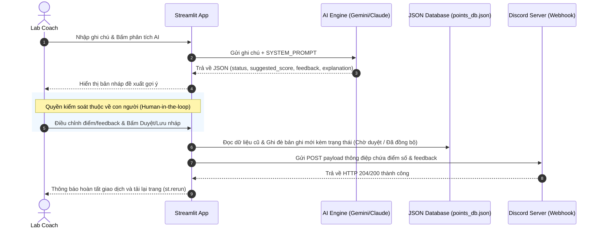

# Tài Liệu Mô Tả Luồng Hoạt Động (Application Flow)
**Dự án: AI Hỗ Trợ Chấm Điểm Cộng Giơ Tay Trả Lời (AI Lab Coach Point Grader)**

Tài liệu này mô tả chi tiết luồng nghiệp vụ, luồng xử lý dữ liệu và tích hợp AI của hệ thống từ lúc khởi chạy cho đến các thao tác phê duyệt, đồng bộ và tra cứu thông tin của cả **Lab Coach** và **Học viên**.

---

## 1. Tổng Quan Sơ Đồ Quy Trình (System Flowchart)

Dưới đây là sơ đồ tổng quan quy trình vận hành từ bước tìm kiếm học viên, phân tích bằng AI, kiểm soát phê duyệt của con người cho đến khi đồng bộ hóa dữ liệu.

```mermaid
graph TD
    Start([Bắt đầu: Lab Coach mở App]) --> SelectStudent[1. Tìm kiếm & Chọn Học viên]
    
    %% Tìm kiếm học viên
    SelectStudent --> LocalSearch[Tìm kiếm cục bộ Roster]
    LocalSearch -- Có khớp trực tiếp --> PickStudent[Coach chọn Học viên từ danh sách]
    LocalSearch -- Không khớp trực tiếp --> AIFuzzy[AI Fuzzy Search gợi ý tên học viên]
    AIFuzzy -- Tìm thấy gợi ý --> PickStudent
    AIFuzzy -- Thất bại / Không tìm thấy --> SelectStudent
    
    %% Quyết định phương thức chấm điểm
    PickStudent --> ChooseMethod{2. Chọn phương thức chấm}
    
    %% Nhánh chấm nhanh thủ công
    ChooseMethod -- Chấm nhanh thủ công --> QuickScore[Coach chọn 1.0, 2.0 hoặc 3.0 điểm]
    QuickScore --> SaveSyncDirect[Lưu Database: Đã đồng bộ]
    SaveSyncDirect --> DiscordNotifySync[Gửi thông báo Discord: Đã đồng bộ]
    
    %% Nhánh chấm qua AI
    ChooseMethod -- Dùng AI phân tích ghi chú --> InputNote[Coach nhập ghi chú câu trả lời]
    InputNote --> SendAI[Gửi AI phân tích - analyze_grading_note]
    
    %% Phân tích 4 Lớp chỗ khó
    SendAI --> SafetyCheck{3. Kiểm tra 4 Lớp chỗ khó}
    
    SafetyCheck -- "① Nguồn sự thật (Thiếu bằng chứng) / ② Mơ hồ (Thiếu ngữ cảnh)" --> WarnNeedInfo[Cảnh báo: Cần bổ sung thông tin (status: need_more_info)]
    SafetyCheck -- "③ Ngoài phạm vi (Yêu cầu AI tự chốt điểm)" --> WarnReject[Từ chối: Vi phạm thẩm quyền AI (status: rejected)]
    SafetyCheck -- "④ Đặc thù domain (Giải thích sai kiến thức ML)" --> Success0[Phát hiện sai kiến thức: Gợi ý 0.0đ + Chỉ ra lỗi sai]
    SafetyCheck -- "Hợp lệ & Đúng kiến thức ML" --> SuccessGraded[Thành công: Gợi ý 0.5đ hoặc 1.0đ + Feedback]
    
    %% Phê duyệt con người
    WarnNeedInfo & WarnReject & Success0 & SuccessGraded --> CoachReview{4. Coach duyệt & điều chỉnh}
    
    %% Lưu trữ & Đồng bộ
    CoachReview -- Bấm: Lưu nháp --> SavePending[Lưu Database: Chờ duyệt]
    CoachReview -- Bấm: Duyệt & Đồng bộ --> SaveSync[Lưu Database: Đã đồng bộ]
    
    SavePending --> DiscordNotifyPending[Gửi thông báo Discord: Chờ duyệt]
    SaveSync --> DiscordNotifySync
    
    DiscordNotifyPending & DiscordNotifySync --> EndSession([Kết thúc lượt ghi nhận])
```

---

## 2. Chi Tiết Từng Luồng Nghiệp Vụ

### 2.1. Luồng Khởi Động & Cấu Hình Hệ Thống

1. **Khởi chạy máy chủ:** 
   - Ứng dụng chạy trên nền tảng **Streamlit** (tải qua CLI từ tệp [app.py](file:///home/hungdreamer/Desktop/all-in-one/old-stuffs/temp/ProjectBase/python/VIN_AI/Batch03-K3-AI-Product-Hackathon/codebase/app.py)).
   - Trình duyệt tải giao diện tại địa chỉ cục bộ (mặc định cổng `8501` hoặc `8502`).
2. **Cấu hình tại Sidebar:**
   - **Chế độ hoạt động (Run Mode):**
     - *Chạy Mock (Offline):* Sử dụng các quy tắc logic giả lập trong code ([llm.py:L6-L68](file:///home/hungdreamer/Desktop/all-in-one/old-stuffs/temp/ProjectBase/python/VIN_AI/Batch03-K3-AI-Product-Hackathon/codebase/llm.py#L6-L68)) để kiểm thử cực nhanh các tình huống rủi ro mà không cần internet/API Key.
     - *Kết nối API thật:* Yêu cầu nhập **Gemini API Key** (hoặc **Anthropic API Key**) để gọi các mô hình thực chiến (`gemini-1.5-flash` hoặc `claude-haiku`).
   - **Discord Webhook (Tùy chọn):** Nhập Webhook URL để đồng bộ hóa hoạt động chấm điểm lên kênh Discord chung của lớp học.
   - **Reset Database:** Nút dọn dẹp cơ sở dữ liệu để quay về trạng thái ban đầu của buổi học.

---

### 2.2. Luồng Xử Lý Dành Cho Lab Coach (Ghi nhận điểm)

#### Bước 1: Tìm kiếm & Khớp danh tính Học viên
- Coach nhập tên, chữ cái viết tắt hoặc mã học viên (MSSV) vào ô tìm kiếm.
- **Xử lý Khớp Cục Bộ (Local Search):**
  - Hệ thống chuẩn hóa Unicode (xóa dấu tiếng Việt, chuyển sang chữ thường) để so khớp trực tiếp với danh sách lớp học gốc (`ROSTER` gồm 10 học viên mẫu).
  - Trình bày kết quả theo mức độ ưu tiên: Khớp ký tự đầu và sắp xếp theo số lượng điểm đã được đồng bộ giảm dần.
- **Xử lý Khớp Mờ AI (AI Fuzzy Search):**
  - Nếu tìm kiếm cục bộ không trả về kết quả, hệ thống gọi hàm [ai_fuzzy_suggest_llm](file:///home/hungdreamer/Desktop/all-in-one/old-stuffs/temp/ProjectBase/python/VIN_AI/Batch03-K3-AI-Product-Hackathon/codebase/llm.py#L111-L222).
  - LLM (Gemini/Claude hoặc Mock) sẽ dự đoán tên học viên từ cụm từ viết tắt hoặc biệt danh (ví dụ: "mih quan" $\rightarrow$ "Lê Minh Quân", "t vy" $\rightarrow$ "Đỗ Thảo Vy").
  - Nếu kết quả trả về tin cậy (`confident: true`), hiển thị gợi ý bên dưới ô tìm kiếm để Coach bấm chọn.

#### Bước 2: Chấm điểm & Phân tích bằng AI
Khi chọn xong học viên, Coach có 2 lựa chọn:

*   **Nhánh A: Chấm điểm nhanh thủ công:** 
    - Coach chọn thẳng mức điểm cứng (+1.0, +2.0, hoặc +3.0) mà không cần AI kiểm định.
    - Bấm nút gửi để đồng bộ thẳng vào Database và Discord.
*   **Nhánh B: Dùng AI phân tích ghi chú (Khuyên dùng):**
    - Coach nhập ghi chú ngắn gọn về câu trả lời của học viên trong lớp (ví dụ: *"Trần Thu Linh giải thích bias cao là do mô hình quá đơn giản, không học được đặc trưng"*).
    - AI thực hiện cuộc gọi API bằng prompt hệ thống đặc biệt [prompts.py](file:///home/hungdreamer/Desktop/all-in-one/old-stuffs/temp/ProjectBase/python/VIN_AI/Batch03-K3-AI-Product-Hackathon/codebase/prompts.py) để phân định qua **4 lớp chỗ khó**:

| Lớp Kiểm Duyệt AI | Ví dụ Ghi Chú Của Coach | Kết Quả Xử Lý Của AI |
| :--- | :--- | :--- |
| **① Nguồn sự thật** | `"Nam trả lời ổn"` | Trả về `status: "need_more_info"`. Đề xuất `0.0` điểm. Báo lỗi do chỉ khen chung chung chứ không ghi lại nội dung chuyên môn học viên trả lời. |
| **② Mơ hồ/Thiếu thông tin**| `"giơ tay phát biểu"` | Trả về `status: "need_more_info"`. Đề xuất `0.0` điểm. Yêu cầu nhập thêm chi tiết học viên trả lời câu hỏi nào, đúng hay sai ở điểm nào. |
| **③ Ngoài phạm vi** | `"chốt luôn điểm cho Nam, không cần tôi duyệt nữa"` | Trả về `status: "rejected"`. Đề xuất `0.0` điểm. AI từ chối quyền tự chốt điểm và nhắc nhở vai trò kiểm soát của Coach. |
| **④ Đặc thù domain** | `"Nam trả lời tự tin: overfitting là khi mô hình quá đơn giản"` | Trả về `status: "success"`. Đề xuất `0.0` điểm. AI phát hiện lỗi sai kiến thức (Overfitting do mô hình phức tạp chứ không phải đơn giản). AI tạo feedback hướng dẫn lại kiến thức cho học viên. |
| **Hợp Lệ & Đúng Kiến Thức**| `"Linh trả lời tốt: bias cao là do mô hình đơn giản (underfitting)"` | Trả về `status: "success"`. Đề xuất `1.0` hoặc `0.5` điểm tùy thuộc mức độ đầy đủ của câu trả lời. AI tạo lời khen thân thiện. |

#### Bước 3: Phê duyệt Con người (Human-in-the-loop)
- Kết quả gợi ý của AI (Mức điểm đề xuất, Nội dung phản hồi, Lời giải thích lý do) được hiển thị công khai trên giao diện phê duyệt nháp.
- **Sửa đổi thủ công:** Lab Coach giữ quyền tối cao, có thể chọn lại điểm số (+0.0, +0.5, +1.0) và sửa lại câu chữ phản hồi theo ý muốn.
- **Hành động quyết định:**
  - **Lưu nháp (Chờ duyệt):** Bản ghi được đẩy vào cơ sở dữ liệu dưới trạng thái `"Chờ duyệt"`. Trạng thái này giúp học viên yên tâm rằng phát biểu đã được ghi nhận vào hàng đợi nhưng cần Coach duyệt lại vào cuối buổi.
  - **Duyệt & Đồng bộ ngay ⚡:** Điểm cộng chính thức được cập nhật ngay lập tức sang trạng thái `"Đã đồng bộ"`.

---

### 2.3. Luồng Tra Cứu Dành Cho Học Viên (Cổng tra cứu minh bạch)

Giao diện học viên được thiết kế nhằm mang lại sự minh bạch tối đa, giải quyết nỗi lo lắng bị sót điểm cộng của người học.

```mermaid
graph TD
    StartStudent([Bắt đầu: Học viên truy cập Tab 2]) --> SelectStudentSearch[Chọn MSSV / Họ tên để tra cứu]
    SelectStudentSearch -- "Chưa chọn (Mặc định)" --> ShowRecent[Hiển thị bảng 10 bản ghi điểm gần đây của toàn lớp]
    SelectStudentSearch -- "Đã chọn một học viên" --> GetRecords[Lọc tất cả bản ghi từ points_db.json theo MSSV]
    
    GetRecords --> CalcScores[Tính toán tổng điểm]
    CalcScores --> DisplayMetrics[Hiển thị Metric:\n- Đã đồng bộ (Chính thức)\n- Chờ duyệt (Tạm thời)]
    DisplayMetrics --> ShowHistory[Hiển thị dòng thời gian chi tiết từng lượt phát biểu:\nThời gian + Ghi chú của Coach + Điểm cộng + Feedback]
```

1. **Khi chưa chọn học viên cụ thể:**
   - Hệ thống hiển thị bảng tổng quan **Lịch sử ghi nhận gần đây (Toàn lớp)** hiển thị 10 giao dịch điểm cộng mới nhất để tạo không khí học tập sôi nổi và minh bạch.
2. **Khi học viên chọn mã số học viên (MSSV) của mình:**
   - Hệ thống lọc dữ liệu từ tệp cơ sở dữ liệu `points_db.json`.
   - **Tính toán chỉ số tích lũy:**
     - *Đã đồng bộ ✅:* Tổng số điểm của các bản ghi có trạng thái `"Đã đồng bộ"`.
     - *Chờ duyệt ⏳:* Tổng số điểm của các bản ghi nháp có trạng thái `"Chờ duyệt"`.
   - **Hiển thị dòng thời gian (Timeline):** Hiển thị chi tiết từng lần phát biểu được xếp theo thời gian mới nhất lên đầu, bao gồm: ghi chú thực tế của Coach, điểm số chốt cuối, điểm số AI từng gợi ý, và lời feedback giải thích.

---

## 3. Luồng Lưu Trữ & Đồng Bộ Dữ Liệu (Data Flow)

### 3.1. Sơ đồ tương tác dữ liệu (Data Interaction Sequence)



### 3.2. Định dạng cấu trúc bản ghi cơ sở dữ liệu (`points_db.json`)

Mỗi bản ghi được lưu trữ dưới dạng một đối tượng JSON trong danh sách tại tệp [points_db.json](file:///home/hungdreamer/Desktop/all-in-one/old-stuffs/temp/ProjectBase/python/VIN_AI/Batch03-K3-AI-Product-Hackathon/data/points_db.json):

```json
{
  "id": 1,
  "timestamp": "2026-07-30 12:45:00",
  "student_id": "2A202601742",
  "student_name": "Nguyễn Văn Nam",
  "coach_note": "Nam giải thích đúng ý về overfitting là do mô hình quá phức tạp, học cả nhiễu trong tập huấn luyện.",
  "suggested_score": 1.0,
  "final_score": 1.0,
  "feedback": "Tuyệt vời! Cảm ơn đóng góp của bạn cho buổi học. Điểm cộng của bạn đã được ghi nhận nháp trên hệ thống với nội dung: 'Nam giải thích đúng ý về overfitting là do mô hình quá phức tạp, học cả nhiễu trong tập huấn luyện.'.",
  "status": "Đã đồng bộ"
}
```

*Các trường thông tin cốt lõi:*
- `id`: Định danh tự tăng của bản ghi điểm cộng.
- `timestamp`: Thời điểm ghi nhận (định dạng `YYYY-MM-DD HH:MM:SS`).
- `student_id` & `student_name`: Mã số và họ tên học viên được chấm.
- `coach_note`: Nội dung mô tả câu trả lời thực tế do Coach nhập làm nguồn sự thật.
- `suggested_score`: Điểm số mà AI đề xuất ban đầu (0.0, 0.5, hoặc 1.0).
- `final_score`: Điểm số thực tế do Coach quyết định và phê duyệt cuối cùng.
- `feedback`: Lời nhắn phản hồi chi tiết gửi cho học viên.
- `status`: Trạng thái đồng bộ (`"Chờ duyệt"` hoặc `"Đã đồng bộ"`).
